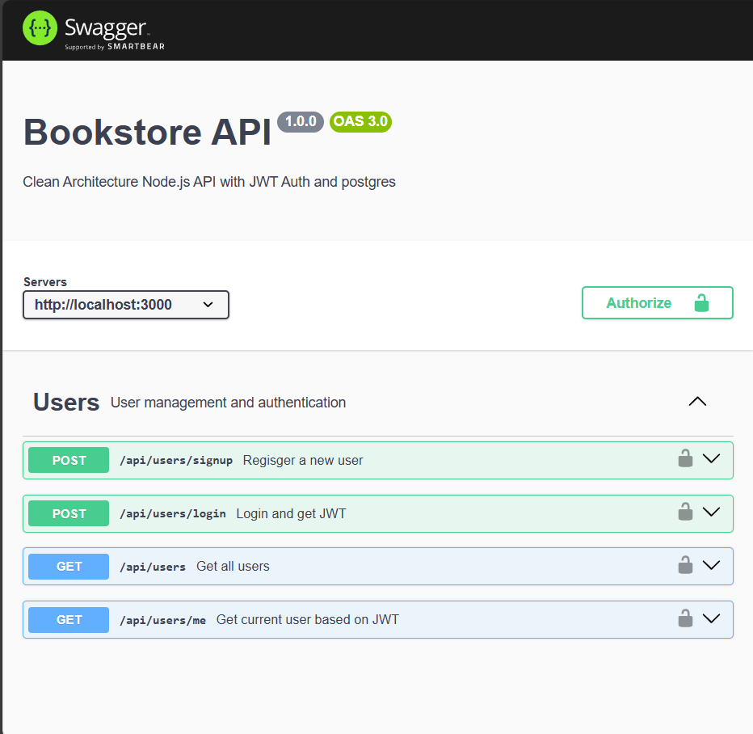

# 📚 Bookstore API (Node.js Clean Architecture)

A fully functional, Dockerized RESTful API for user authentication and management, built with **Node.js**, **Express**, **PostgreSQL**, and **JWT** using **Clean Architecture principles**.

This project demonstrates scalable backend design, including Swagger API docs, unit tests with Jest, environment configurations, and containerized deployment.

---

## 🧰 Tech Stack

- **Node.js + Express.js**
- **PostgreSQL**
- **JWT Authentication**
- **Docker & Docker Compose**
- **Swagger UI for API docs**
- **Jest for unit testing**
- **Clean Architecture Pattern**

---

## 📁 Project Structure (Clean Architecture)

**bookstore-api-nodejs-clean/**
**├── config/ # Swagger configuration**
**├── domain/ # Core domain models**
**├── usecases/ # Business logic layer (tested)
**├── infrastructure/
**│ ├── db/ # PostgreSQL logic & user repository
**│ └── middleware/ # JWT authentication middleware
**├── interfaces/
**│ ├── controllers/ # HTTP controller layer
**│ └── routes/ # Express route layer with Swagger docs
**├── .env # Environment variables**
**├── Dockerfile # App container config**
**├── docker-compose.yml # Multi-container setup**
**├── server.mjs # Entry point with Swagger + express setup**
**└── package.json**


---

## 🚀 Getting Started

### 1️⃣ Clone the repository

```bash
git clone https://github.com/Abdul-Rahim-K-T/bookstore-api-nodejs-clean.git
cd bookstore-api-nodejs-clean

---

## ⚙️ Environment Variables

Create a `.env` file in the root directory:

```env
PORT=3000

DB_USER=postgres
DB_HOST=localhost
DB_NAME=bookstore
DB_PASSWORD=your_database_password
DB_PORT=5432

JWT_SECRET=your_super_secret_key


---

## 🐳 Dockerized Setup

Run the app using Docker:

```bash
docker-compose up --build
🟢 Application will be available at: http://localhost:3000
📘 Swagger UI: http://localhost:3000/api-docs

Containers:

bookstore_api: Node.js backend

pg_bookstore: PostgreSQL database

| Method | Endpoint            | Description             | Auth |
| ------ | ------------------- | ----------------------- | ---- |
| POST   | `/api/users/signup` | Register new user       | ❌    |
| POST   | `/api/users/login`  | Login and receive token | ❌    |
| GET    | `/api/users`        | Get all users           | ❌    |
| GET    | `/api/users/me`     | Get current user info   | ✅    |

---

📘 API Documentation (Swagger)
All routes are documented using Swagger (OpenAPI 3.0).

To access the docs:

👉 `http://localhost:3000/api-docs`

📌 Sample Screenshot:



You can try out endpoints directly in your browser.

#### 🧪 3. **Tests Section (Expanded)**

You wrote great usecase tests! Add this:

```markdown
---

## 🧪 Running Tests

Run unit tests with [Jest](https://jestjs.io/):

```bash
npm test


---

#### 📘 4. **Swagger UI Preview (Screenshot or Example)**

Add a short visual or explanation to catch attention:

```markdown
---

## 📘 API Documentation with Swagger

All routes are documented using Swagger (OpenAPI 3.0).

Visit Swagger UI:

👉 `http://localhost:3000/api-docs`

📌 Sample Screenshot:
 
